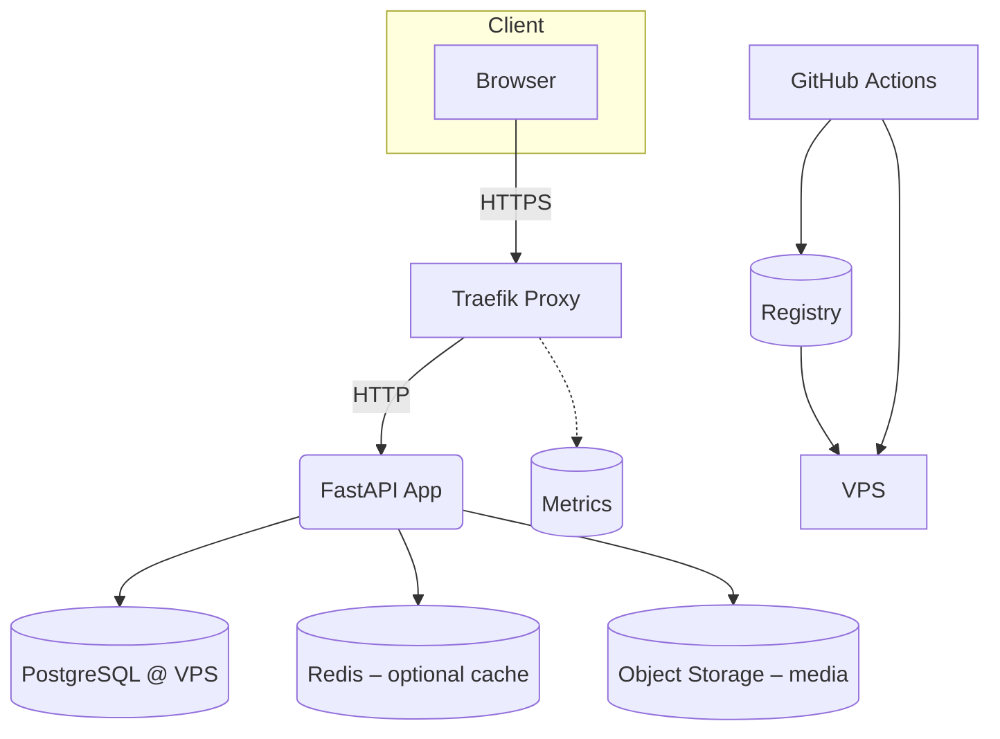
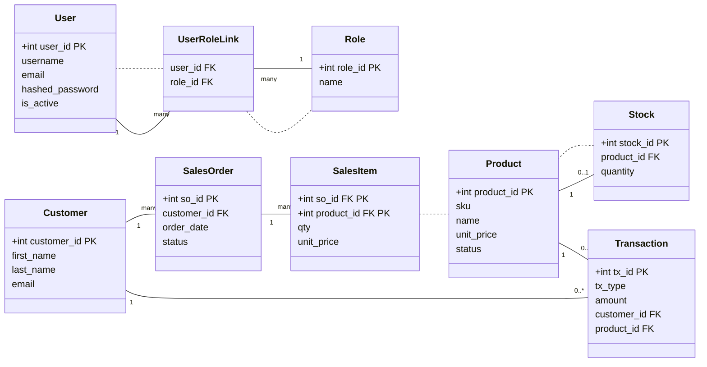
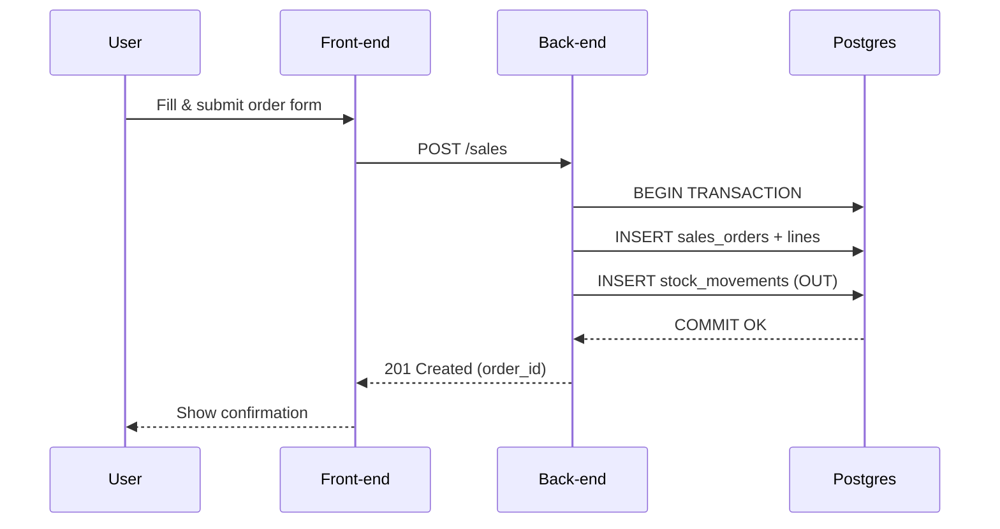

# Brain2Gain ERP

> **Goal:** Provide an open‑source ERP tailored to a supplement business – inventory, purchasing, sales, finance dashboards – deployable with Docker, Traefik and Postgres.

---

## 🌐 Tech Stack

| Layer               | Tech                                                      | Why                                   |
| ------------------- | --------------------------------------------------------- | ------------------------------------- |
| Backend             | **FastAPI + SQLModel**                                    | async, type‑safe, auto‑generated docs |
| Database            | **PostgreSQL**                                            | strong relational model, JSONB        |
| Migrations          | **Alembic**                                               | reliable versioned DDL                |
| Auth                | **JWT (PyJWT) + OAuth2 Password**                         | standard & scalable                   |
| Front‑end           | **React (Vite) + TypeScript + TanStack Query + Tailwind** | fast DX, composable UI                |
| Reverse proxy / TLS | **Traefik v3**                                            | zero‑downtime, Let’s Encrypt          |
| Dev Env             | **Docker Compose**, **pre‑commit**, **ruff**, **pytest**  | reproducible, opinionated linting     |
| CI/CD               | **GitHub Actions → DockerHub → VPS**                      | ship on every push                    |

---

## 📂 Repository Layout (top‑level)

```
jazzdatasolutions-b2g_website/
├── backend/           # FastAPI service
│   ├── app/           # domain packages (models, crud, api)
│   ├── alembic/       # migrations
│   └── ...
├── frontend/          # React SPA
│   ├── src/
│   └── vite.config.ts
├── ops/               # Terraform / Ansible infra (future)
├── docker-compose*.yml
└── docs/              # this README + ADRs + diagrams
```

> **Tip:** keep docs in `docs/` so diagrams render on GitHub without polluting code.

---

## 🏗️ High‑Level Architecture



---

## 📊 Data‑Model (ER Diagram)



> **Extend** with `transactions`, `accounts`, `returns`, `users` (RBAC) as the ERP grows.

---

## 🔄  Sequence Diagram – "Create Sale"



---

## ⚙️ Local Development

1. **Copy envs**

   ```bash
   cp .env.example backend/.env
   cp .env.example frontend/.env
   ```
2. **Start stack**

   ```bash
   docker compose -f docker-compose.dev.yml up --build
   ```
3. Back‑end docs on [http://localhost:8000/docs](http://localhost:8000/docs).
4. Front‑end on [http://localhost:5173](http://localhost:5173) (Vite hot‑reload).

> **DB Migrations**: `docker compose exec backend alembic upgrade head`.

---

## 🚀 Deployment (VPS + Traefik)

1. Point A record to VPS.
2. Clone repo & set environment secrets.
3. `docker compose -f docker-compose.traefik.yml up -d` – Traefik issues certs via Let’s Encrypt.
4. Backups: schedule `pg_dump` to S3/Backblaze nightly.

---

## 🖌️ Front‑end Overview

| Area      | Path                  | Key libs                  |
| --------- | --------------------- | ------------------------- |
| Routing   | `src/router.tsx`      | *react‑router‑dom* v6     |
| API layer | `src/services/api.ts` | *axios*, *TanStack Query* |
| State     | React Query cache     | avoids Redux boilerplate  |
| UI        | Tailwind + shadcn/ui  | consistent design system  |

Run `npm i && npm run dev` when hacking UI only.

---

## 🗺️ Roadmap

### Quick Wins (1–2 weeks)

*

### Strategic Enhancements (1–3 months)

*

### Moon‑shot (6 months+)

* SaaS multi‑tenant mode.
* Plug‑in marketplace (custom modules).
* Mobile app via Capacitor.

---

## 🤝 Contributing

1. Fork / branch off `main`.
2. `pre-commit install`.
3. `pytest -q` before PR.

---

## 📜 License

MIT © 2025 Brain2Gain

