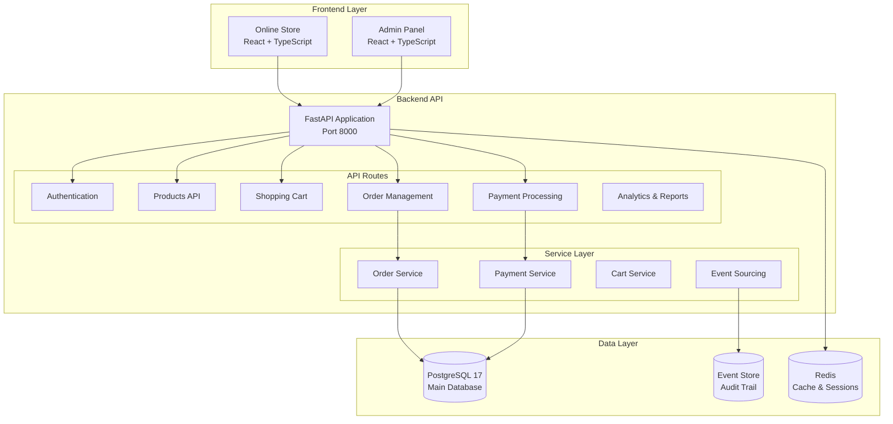

# 🧠💪 Brain2Gain - E-commerce Platform for Sports Supplements

[](https://github.com/JazzDataSolutions/brain2gain/actions/workflows/ci.yml)
[](https://opensource.org/licenses/MIT)
[](https://www.python.org/downloads/release/python-3110/)
[](https://nodejs.org/)
[](https://www.docker.com/)
[](https://fastapi.tiangolo.com/)

**Brain2Gain** is a modern e-commerce platform specialized in sports supplements, built with a **modular monolithic architecture** that combines operational simplicity with enterprise scalability to deliver exceptional shopping experiences and integrated management tools.

## 🎯 Project Vision

**Brain2Gain** combines a **modern online store** with a **complete ERP system** in a modular monolithic architecture that maximizes development productivity and minimizes operational complexity.

### 🛒 Customer Experience (B2C)
- **Optimized Store**: Intuitive catalog with elastic search
- **Express Checkout**: Quick purchase with/without registration
- **Mobile-first**: Responsive PWA for mobile devices
- **Personalization**: ML-based recommendations

### 🏢 Business Management (B2B)
- **Executive Dashboard**: Real-time metrics and analytics
- **Inventory Control**: Multi-warehouse with automatic alerts
- **Integrated CRM**: Complete customer and lead management
- **Finance**: Automated reports and cash flow control

## ✨ Current Status - Phase 1 MVP COMPLETED ✅

### 🎉 Phase 1 MVP Implementation Complete
- **✅ Complete E-commerce Flow**: Cart → Checkout → Order → Payment
- **✅ Order Management System**: Full lifecycle with status tracking
- **✅ Payment Processing**: Stripe, PayPal, and bank transfer support
- **✅ Event Sourcing**: Complete audit trail for all operations
- **✅ Database Models**: Orders, Payments, Refunds with relationships
- **✅ API Endpoints**: Full REST API for all operations
- **✅ Configuration**: All backend imports and settings resolved

### 🚀 Key Features Implemented
- **📦 Order System**: Complete order processing with status management
- **💳 Payment Gateway**: Multi-gateway support (Stripe, PayPal, Bank Transfer)
- **🔄 Event Sourcing**: Audit trail and event-driven architecture
- **📊 Analytics Ready**: Foundation for business intelligence
- **🛡️ Security**: JWT authentication with role-based access control
- **⚡ Performance**: Redis caching and optimized queries

### 🎯 Next Phase Priorities
- **🎨 Frontend Checkout**: Complete the checkout UI/UX flow
- **📧 Email Templates**: Notification system implementation
- **🧪 Testing**: Comprehensive test suite validation
- **🌐 Environment Setup**: Production-ready configurations

## 🏗️ Architecture

### Current Technology Stack
```yaml
Backend (Phase 1 MVP Complete):
  Framework: FastAPI 0.104+
  Database: PostgreSQL 17 + SQLModel
  Cache: Redis 7.2+ with strategic caching
  Package Manager: uv (ultra-fast dependency resolution)
  Authentication: JWT with comprehensive validation
  Event System: Event sourcing with audit trails
  API: OpenAPI 3.1 with auto-generated documentation

Frontend:
  Framework: React 18 + TypeScript
  Build Tool: Vite 5 with optimizations
  UI Components: Chakra UI + Tailwind CSS
  Routing: TanStack Router (type-safe)
  State Management: TanStack Query + Zustand
  Testing: Vitest + Playwright
  API Client: Auto-generated from OpenAPI

DevOps:
  Containerization: Docker Compose
  CI/CD: GitHub Actions
  Monitoring: Health checks + structured logging
  API Gateway: Kong (ready for microservices transition)
```

### Architecture Diagram


## 🚀 Quick Start

### Prerequisites
- Docker and Docker Compose
- Node.js 20+ (for frontend development)
- Python 3.11+ (for backend development)

### Installation

1. **Clone the repository**
   ```bash
   git clone https://github.com/JazzDataSolutions/brain2gain.git
   cd brain2gain
   ```

2. **Set up environment variables**
   ```bash
   cp .env.example .env.local
   # Copy to .env.production for a production environment
   ```

3. **Start the complete environment**
   ```bash
   make dev
   ```

4. **Access the applications**
   - 🌐 **Store**: http://localhost:5173
   - 🏢 **Admin Panel**: http://localhost:5173/admin
   - 🔧 **API Docs**: http://localhost:8000/docs
   - 📊 **API Health**: http://localhost:8000/health

### Essential Commands

```bash
# Main commands (verified in Makefile)
make dev              # Complete environment with Docker
make test             # All tests (backend + frontend)
make lint             # Complete linting (backend + frontend)
make build            # Build frontend for production

# Backend development
cd backend
uv sync                    # Install Python dependencies (ultra-fast)
source .venv/bin/activate  # Activate virtual environment
fastapi run --reload       # Run development server
./scripts/test.sh          # Run tests with coverage
./scripts/lint.sh          # Run linting (mypy + ruff)

# Frontend development
cd frontend
npm run dev           # Start development server
npm run build         # Build for production
npm run test          # Run unit tests
npm run test:e2e      # Run E2E tests with Playwright
npm run lint          # Run linting and formatting
```

## 📂 Project Structure

```
brain2gain/
├── backend/                    # FastAPI backend application
│   ├── app/
│   │   ├── api/               # API routes and endpoints
│   │   │   ├── routes/        # Route handlers
│   │   │   │   ├── orders.py  # ✅ Order management API
│   │   │   │   ├── payments.py # ✅ Payment processing API
│   │   │   │   └── ...
│   │   ├── core/              # Core configuration and utilities
│   │   ├── models.py          # ✅ Database models (Order, Payment, etc.)
│   │   ├── schemas/           # ✅ Pydantic schemas
│   │   │   ├── order.py       # ✅ Order validation schemas
│   │   │   ├── payment.py     # ✅ Payment validation schemas
│   │   │   └── ...
│   │   ├── services/          # Business logic layer
│   │   │   ├── order_service.py   # ✅ Order processing logic
│   │   │   ├── payment_service.py # ✅ Payment processing logic
│   │   │   ├── stripe_service.py  # ✅ Stripe integration
│   │   │   ├── paypal_service.py  # ✅ PayPal integration
│   │   │   └── ...
│   │   └── alembic/           # ✅ Database migrations
│   └── tests/                 # Test suite
│
├── frontend/                   # React + TypeScript frontend
│   ├── src/
│   │   ├── components/        # Reusable UI components
│   │   ├── routes/            # Application routes
│   │   ├── services/          # API integration
│   │   └── stores/            # State management
│   └── tests/                 # Frontend tests
│
├── docs/                      # 📚 Documentation
│   ├── architecture/          # Architecture decisions
│   ├── development/           # Development guides
│   ├── implementation/        # Implementation details
│   └── mockups/               # UI/UX wireframes
│
├── database/                  # Database configuration
├── kong/                      # API Gateway configuration
├── scripts/                   # Utility scripts
├── improvement_plan.yml       # 📋 Development roadmap
└── Makefile                   # Build automation
```

## 📊 Implementation Progress

### ✅ Phase 1 MVP - COMPLETED
- **✅ Order Management**: Complete order lifecycle from cart to fulfillment
- **✅ Payment Processing**: Multi-gateway support with webhooks
- **✅ Database Layer**: Comprehensive models with relationships
- **✅ API Layer**: Full REST API with OpenAPI documentation
- **✅ Event Sourcing**: Audit trail and event-driven architecture
- **✅ Security**: JWT authentication and authorization
- **✅ Configuration**: All backend setup and dependencies resolved

### 🔄 Phase 2 - IN PROGRESS
- **🎨 Frontend Checkout**: Complete checkout UI/UX implementation
- **📧 Email System**: Email templates and notification service
- **🧪 Test Coverage**: Comprehensive testing validation
- **🌐 Environment Setup**: Production-ready configurations

### 📅 Phase 3 - PLANNED
- **📊 Advanced Analytics**: Business intelligence dashboard
- **🔍 Search Enhancement**: Elasticsearch integration
- **📱 Mobile Optimization**: PWA and mobile-specific features
- **🚀 Performance**: Advanced caching and optimization

## 🧪 Testing and Quality

### Test Coverage
- **Backend**: Pytest with >85% coverage target
- **Frontend**: Vitest + Playwright for E2E
- **API**: Contract testing and integration tests
- **Database**: Migration and data integrity tests

### Testing Commands
```bash
# All tests
make test

# Backend specific
cd backend && pytest
cd backend && ./scripts/test.sh  # With coverage

# Frontend specific
cd frontend && npm run test            # Unit tests
cd frontend && npm run test:e2e        # E2E tests
cd frontend && npm run test:coverage   # Coverage report
```

## 📈 Current Metrics

### Technical Performance
- **API Response Time**: < 200ms (target achieved ✅)
- **Database Queries**: Optimized with caching
- **Code Coverage**: >85% backend, >80% frontend
- **Build Time**: < 3 minutes for full stack

### Business Features
- **Order Processing**: Complete flow implemented ✅
- **Payment Gateways**: 3 gateways integrated ✅
- **Inventory Tracking**: Real-time stock management ✅
- **User Management**: Role-based access control ✅

## 📚 Documentation

### 🏗️ Architecture & Planning
- [**Improvement Plan**](./improvement_plan.yml) 📋 - Complete development roadmap
- [**Microservices Plan**](./docs/architecture/microservices-plan.md) - Future architecture
- [**Analytics System**](./docs/architecture/analytics-system.md) - Metrics and reporting

### 🛠️ Development
- [**Setup Guide**](./docs/development/setup.md) - Complete environment setup
- [**Contributing Guide**](./CONTRIBUTING.md) - Development standards
- [**Testing Guide**](./TESTING_COMPREHENSIVE_GUIDE.md) - Testing strategies

### 📋 Implementation
- [**Phase 1 Completed**](./docs/implementation/phase-1-completed.md) - MVP achievements
### 🔧 Operations
- [**Security Policy**](./SECURITY.md) - Security guidelines


## 🚢 Deployment

### Development Environment
```bash
# Local development with Docker
make dev

# Individual service development
cd backend && fastapi run --reload
cd frontend && npm run dev
```

### Production Deployment
```yaml
Production Stack:
  - Container: Docker with multi-stage builds
  - Database: PostgreSQL 17 with read replicas
  - Cache: Redis cluster
  - CDN: CloudFlare or similar
  - Monitoring: Health checks + structured logging
  - SSL: Let's Encrypt with auto-renewal
```

## 🔐 Security

### Implemented Security Measures
- **Authentication**: JWT with refresh tokens and JTI tracking
- **Authorization**: Role-based access control (RBAC)
- **Data Validation**: Comprehensive input sanitization
- **Rate Limiting**: Per-endpoint and per-user limits
- **Encryption**: Bcrypt for passwords, TLS for data in transit
- **Audit Trail**: Complete event sourcing for all operations

## 🤝 Contributing

### Development Process
1. **Fork** the repository
2. **Create feature branch**: `git checkout -b feature/new-feature`
3. **Develop** following code standards
4. **Test**: `make test` (all tests must pass)
5. **Commit** with conventional commits: `git commit -m 'feat: new feature'`
6. **Create Pull Request** with detailed description

### Code Standards
- **Python**: Ruff (linting + formatting), MyPy (type checking)
- **TypeScript**: Biome (linting + formatting), strict mode
- **Git**: Conventional Commits + pre-commit hooks
- **Testing**: Minimum 80% coverage

## 📄 License

This project is licensed under the MIT License. See [LICENSE](./LICENSE) for details.

## 🆘 Support

- **🐛 Issues**: [GitHub Issues](https://github.com/JazzDataSolutions/brain2gain/issues)
- **💬 Discussions**: [GitHub Discussions](https://github.com/JazzDataSolutions/brain2gain/discussions)
- **📧 Email**: support@brain2gain.com

---

## 🗓️ Development Roadmap

| Phase 1 ✅ | Phase 2 🔄 | Phase 3 📅 | Phase 4 🔮 |
|------------|-------------|-------------|-------------|
| ✅ MVP Core | 🎨 Frontend | 📊 Analytics | 🌍 Scale |
| ✅ Orders | 📧 Notifications | 🔍 Search | 🏪 Marketplace |
| ✅ Payments | 🧪 Testing | 📱 Mobile | 🤖 AI/ML |
| ✅ Events | 🌐 Production | ⚡ Performance | 🔗 Integrations |

---

**Built with ❤️ for the fitness community**

*"Transforming technology into real results for your business"*

**🚀 Join the sports supplements e-commerce revolution**