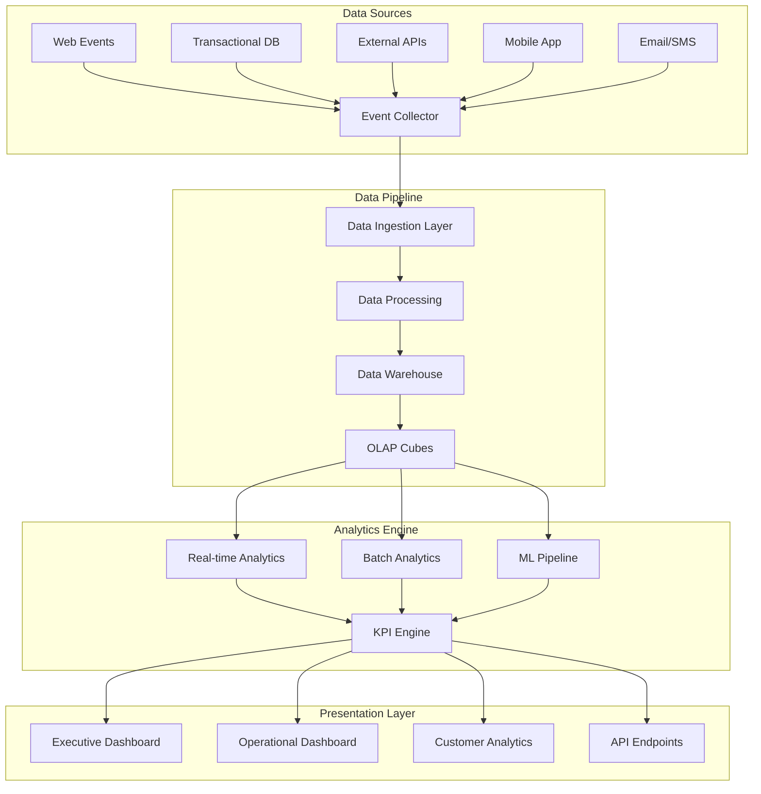

# 📊 Brain2Gain - Enterprise Analytics Architecture

## 🎯 Visión Estratégica

Como plataforma de e-commerce de suplementos deportivos, Brain2Gain requiere un sistema de analytics empresarial robusto que proporcione insights accionables para optimizar operaciones, maximizar conversiones y mejorar la experiencia del cliente.

## 🏗️ Arquitectura de Analytics

### 📈 Modelo de Datos Empresarial



### 🔢 KPIs Estratégicos por Área

#### 💰 Métricas Financieras
- **Revenue Growth Rate**: Crecimiento mensual/anual
- **Average Order Value (AOV)**: Valor promedio por pedido
- **Customer Lifetime Value (CLV)**: Valor de vida del cliente
- **Monthly Recurring Revenue (MRR)**: Ingresos recurrentes
- **Gross Margin**: Margen bruto por producto/categoría
- **Cost Per Acquisition (CAC)**: Costo de adquisición
- **Payback Period**: Período de recuperación CAC
- **Revenue Per Visitor (RPV)**: Ingresos por visitante

#### 🛒 Métricas de Conversión
- **Conversion Rate**: Tasa de conversión general
- **Cart Abandonment Rate**: Abandono de carrito
- **Checkout Completion Rate**: Finalización de compra
- **Product Page Conversion**: Conversión por producto
- **Funnel Conversion Rates**: Conversión por etapa
- **Upsell/Cross-sell Rate**: Ventas adicionales
- **Return Customer Rate**: Tasa de clientes recurrentes

#### 👥 Métricas de Cliente
- **Net Promoter Score (NPS)**: Recomendación del cliente
- **Customer Satisfaction (CSAT)**: Satisfacción del cliente
- **Churn Rate**: Tasa de abandono
- **Retention Rate**: Tasa de retención
- **Engagement Score**: Puntuación de compromiso
- **Support Ticket Resolution**: Resolución de tickets

#### 📦 Métricas Operacionales
- **Inventory Turnover**: Rotación de inventario
- **Stockout Rate**: Tasa de agotamiento
- **Order Fulfillment Time**: Tiempo de preparación
- **Shipping Accuracy**: Precisión de envíos
- **Return Rate**: Tasa de devoluciones
- **Supplier Performance**: Rendimiento de proveedores

### 🧠 Analytics Avanzados

#### 🔍 Segmentación de Clientes
```python
# RFM Analysis - Recencia, Frecuencia, Valor Monetario
customer_segments = {
    "Champions": {"R": [4,5], "F": [4,5], "M": [4,5]},     # 11.1%
    "Loyal_Customers": {"R": [2,5], "F": [3,5], "M": [3,5]}, # 15.6%
    "Potential_Loyalists": {"R": [3,5], "F": [1,3], "M": [1,3]}, # 18.2%
    "New_Customers": {"R": [4,5], "F": [1,1], "M": [1,1]},   # 13.3%
    "Promising": {"R": [3,4], "F": [1,1], "M": [2,3]},      # 12.9%
    "Need_Attention": {"R": [2,3], "F": [2,3], "M": [2,3]}, # 8.1%
    "About_to_Sleep": {"R": [2,3], "F": [1,2], "M": [1,2]}, # 7.8%
    "At_Risk": {"R": [1,2], "F": [2,4], "M": [2,4]},        # 7.3%
    "Cannot_Lose": {"R": [1,2], "F": [4,5], "M": [4,5]},    # 2.4%
    "Hibernating": {"R": [1,2], "F": [1,2], "M": [1,2]}     # 3.3%
}
```

#### 📊 Análisis de Cohortes
- **Revenue Cohorts**: Análisis de ingresos por cohorte de registro
- **Retention Cohorts**: Retención por mes de primera compra
- **Product Cohorts**: Adopción de productos por categoría
- **Channel Cohorts**: Performance por canal de adquisición

#### 🎯 Market Basket Analysis
- **Affinity Rules**: Productos frecuentemente comprados juntos
- **Cross-sell Opportunities**: Oportunidades de venta cruzada
- **Bundle Optimization**: Optimización de paquetes
- **Seasonal Patterns**: Patrones estacionales de compra

### 🤖 Machine Learning Models

#### 📈 Modelos Predictivos
```python
# Churn Prediction Model
features = [
    'days_since_last_order',
    'total_orders',
    'avg_order_value',
    'product_diversity',
    'support_tickets',
    'email_engagement',
    'session_frequency',
    'cart_abandonment_rate'
]

# Random Forest para predicción de churn
churn_model = RandomForestClassifier(
    n_estimators=100,
    max_depth=10,
    feature_importance=True
)
```

#### 💰 Revenue Forecasting
```python
# SARIMA Model para forecasting de ingresos
revenue_forecast = SARIMAX(
    revenue_data,
    order=(1,1,1),
    seasonal_order=(1,1,1,12),
    trend='ct'
)
```

#### 🛍️ Recommendation Engine
```python
# Collaborative Filtering + Content-Based
recommendation_models = {
    'collaborative': NearestNeighbors(metric='cosine'),
    'content_based': TfidfVectorizer() + cosine_similarity,
    'hybrid': weighted_ensemble([collaborative, content_based])
}
```

### 📱 Real-time Analytics Engine

#### ⚡ Stream Processing
```yaml
Events Pipeline:
  Input: Kafka Topics
    - page_views
    - add_to_cart
    - purchases
    - user_sessions
  
  Processing: Apache Flink
    - Event aggregation
    - Real-time KPI calculation
    - Anomaly detection
    - Alert triggering
  
  Output: 
    - Redis (real-time metrics)
    - PostgreSQL (aggregated data)
    - ElasticSearch (search analytics)
```

## 📊 Dashboard Architecture

### 🎛️ Executive Dashboard
**Objetivo**: Vista estratégica para C-level

```typescript
interface ExecutiveDashboard {
  timeframe: 'daily' | 'weekly' | 'monthly' | 'quarterly'
  kpis: {
    revenue: {
      current: number
      target: number
      growth: number
      forecast: number[]
    }
    customers: {
      total: number
      new: number
      churn: number
      ltv: number
    }
    operations: {
      orders: number
      aov: number
      conversion: number
      margin: number
    }
  }
  trends: ChartData[]
  alerts: Alert[]
  cohorts: CohortData[]
}
```

### 📈 Operational Dashboard
**Objetivo**: Métricas operacionales en tiempo real

```typescript
interface OperationalDashboard {
  realtime: {
    activeUsers: number
    currentRevenue: number
    ordersPendingFulfillment: number
    inventoryAlerts: InventoryAlert[]
  }
  performance: {
    conversionFunnel: FunnelData
    topProducts: ProductMetrics[]
    channelPerformance: ChannelData[]
    customerSupport: SupportMetrics
  }
  financials: {
    dailyRevenue: number
    monthlyProjection: number
    profitMargin: number
    cashFlow: CashFlowData
  }
}
```

### 👥 Customer Analytics Dashboard
**Objetivo**: Insights profundos del comportamiento del cliente

```typescript
interface CustomerAnalyticsDashboard {
  segmentation: {
    rfmSegments: RFMData[]
    behavioralSegments: BehavioralData[]
    demographicSegments: DemographicData[]
  }
  journeyAnalysis: {
    touchpoints: Touchpoint[]
    conversionPaths: Path[]
    dropoffPoints: DropoffData[]
  }
  predictive: {
    churnProbability: ChurnData[]
    cltv: CLTVData[]
    nextBestAction: ActionRecommendation[]
  }
}
```

## 🔧 Tecnologías y Stack

### 🗄️ Data Stack
```yaml
Data Ingestion:
  - Apache Kafka: Event streaming
  - Debezium: CDC from PostgreSQL
  - Airbyte: External data connectors

Data Processing:
  - Apache Flink: Real-time processing
  - Apache Airflow: Batch processing orchestration
  - dbt: Data transformation

Data Storage:
  - PostgreSQL: OLTP + analytical queries
  - ClickHouse: OLAP + time-series
  - Redis: Real-time cache
  - S3: Data lake

Analytics & ML:
  - Apache Superset: BI/visualization
  - MLflow: ML lifecycle management
  - Apache Spark: Large-scale ML
  - TensorFlow/PyTorch: Deep learning
```

### 📊 Visualization Stack
```yaml
Frontend:
  - React + TypeScript
  - Recharts/D3.js: Custom charts
  - Apache ECharts: Advanced visualizations
  - Plotly: Interactive analytics

Backend:
  - FastAPI: Analytics APIs
  - WebSockets: Real-time updates
  - GraphQL: Flexible data queries
  - Celery: Background tasks
```

## 📈 KPI Calculation Framework

### 💰 Revenue Metrics Engine
```python
class RevenueAnalytics:
    def calculate_mrr(self, period: str) -> float:
        """Monthly Recurring Revenue calculation"""
        subscription_revenue = self.get_subscription_revenue(period)
        return subscription_revenue
    
    def calculate_arr(self) -> float:
        """Annual Recurring Revenue"""
        return self.calculate_mrr('current') * 12
    
    def calculate_ltv(self, customer_id: str) -> float:
        """Customer Lifetime Value"""
        avg_monthly_revenue = self.get_avg_monthly_revenue(customer_id)
        avg_lifespan_months = self.get_avg_lifespan(customer_id)
        gross_margin = self.get_gross_margin()
        
        return avg_monthly_revenue * avg_lifespan_months * gross_margin
    
    def calculate_cac_payback(self, channel: str) -> int:
        """CAC Payback Period in months"""
        cac = self.get_cac(channel)
        avg_monthly_margin = self.get_avg_monthly_margin()
        
        return int(cac / avg_monthly_margin)
```

### 🎯 Conversion Analytics
```python
class ConversionAnalytics:
    def calculate_funnel_conversion(self, steps: List[str]) -> Dict:
        """Multi-step funnel conversion analysis"""
        funnel_data = {}
        
        for i, step in enumerate(steps):
            if i == 0:
                funnel_data[step] = self.get_step_users(step)
            else:
                prev_users = funnel_data[steps[i-1]]
                current_users = self.get_step_users(step)
                conversion_rate = (current_users / prev_users) * 100
                
                funnel_data[step] = {
                    'users': current_users,
                    'conversion_rate': conversion_rate,
                    'drop_off': prev_users - current_users
                }
        
        return funnel_data
    
    def cohort_retention_analysis(self, cohort_period: str) -> DataFrame:
        """Cohort retention analysis"""
        cohorts = self.get_cohorts(cohort_period)
        retention_table = []
        
        for cohort in cohorts:
            cohort_data = self.get_cohort_activity(cohort)
            retention_rates = self.calculate_retention_rates(cohort_data)
            retention_table.append(retention_rates)
        
        return pd.DataFrame(retention_table)
```

## 🚨 Alert System

### 📊 Intelligent Alerting
```python
class AlertSystem:
    def __init__(self):
        self.alert_rules = [
            {
                'name': 'Revenue Drop',
                'condition': 'daily_revenue < avg_daily_revenue * 0.8',
                'severity': 'critical',
                'channels': ['email', 'slack', 'webhook']
            },
            {
                'name': 'Conversion Rate Drop',
                'condition': 'conversion_rate < historical_avg * 0.9',
                'severity': 'warning',
                'channels': ['email', 'slack']
            },
            {
                'name': 'Inventory Low',
                'condition': 'stock_level < reorder_point',
                'severity': 'info',
                'channels': ['email']
            },
            {
                'name': 'High Churn Risk',
                'condition': 'predicted_churn_rate > 0.8',
                'severity': 'warning',
                'channels': ['email', 'crm_integration']
            }
        ]
    
    def evaluate_alerts(self):
        """Evaluate all alert conditions"""
        triggered_alerts = []
        
        for rule in self.alert_rules:
            if self.evaluate_condition(rule['condition']):
                alert = self.create_alert(rule)
                triggered_alerts.append(alert)
                self.send_alert(alert, rule['channels'])
        
        return triggered_alerts
    
    def anomaly_detection(self, metric: str, window: int = 7):
        """Statistical anomaly detection"""
        data = self.get_metric_data(metric, window)
        
        # Z-score based detection
        z_scores = np.abs(stats.zscore(data))
        threshold = 2.5
        
        anomalies = data[z_scores > threshold]
        
        if len(anomalies) > 0:
            self.trigger_anomaly_alert(metric, anomalies)
```

## 📊 Reporting Framework

### 📈 Automated Reports
```python
class ReportGenerator:
    def generate_executive_report(self, period: str) -> Dict:
        """Generate executive summary report"""
        return {
            'summary': {
                'period': period,
                'revenue': self.get_revenue_summary(period),
                'growth': self.get_growth_metrics(period),
                'customers': self.get_customer_metrics(period),
                'key_achievements': self.get_achievements(period),
                'action_items': self.get_action_items(period)
            },
            'financial_highlights': self.get_financial_highlights(period),
            'operational_metrics': self.get_operational_metrics(period),
            'market_insights': self.get_market_insights(period),
            'forecasts': self.get_forecasts(period)
        }
    
    def generate_product_report(self, product_id: str) -> Dict:
        """Product performance deep dive"""
        return {
            'performance': self.get_product_performance(product_id),
            'customer_segments': self.get_product_segments(product_id),
            'pricing_analysis': self.get_pricing_analysis(product_id),
            'competitive_position': self.get_competitive_analysis(product_id),
            'recommendations': self.get_product_recommendations(product_id)
        }
    
    def schedule_reports(self):
        """Schedule automated report generation"""
        schedule.every().day.at("08:00").do(
            self.send_daily_metrics_report
        )
        schedule.every().week.at("monday").do(
            self.send_weekly_executive_report
        )
        schedule.every().month.at("1st").do(
            self.send_monthly_financial_report
        )
```

## 🎯 Implementation Roadmap

### 📅 Fase 1 (Semana 1): Core Analytics
- ✅ Implementar métricas básicas de revenue
- ✅ Dashboard ejecutivo MVP
- ✅ Sistema de alertas básico
- ✅ API de métricas en tiempo real

### 📅 Fase 2 (Semana 2): Advanced Analytics  
- 🔄 Segmentación RFM de clientes
- 🔄 Análisis de cohortes
- 🔄 Funnel de conversión detallado
- 🔄 Reportes automatizados

### 📅 Fase 3 (Semana 3): Predictive Analytics
- 📋 Modelos de churn prediction
- 📋 Revenue forecasting
- 📋 Recommendation engine
- 📋 Inventory optimization

### 📅 Fase 4 (Semana 4): Advanced Visualization
- 📋 Dashboard interactivo avanzado
- 📋 Custom visualizations
- 📋 Mobile analytics app
- 📋 Real-time monitoring

## 🔒 Data Governance & Privacy

### 🛡️ Data Security
- **Encryption**: All data encrypted at rest and in transit
- **Access Control**: Role-based access to sensitive metrics
- **Audit Trail**: Complete audit log of data access
- **GDPR Compliance**: Privacy-first analytics design

### 📊 Data Quality
- **Validation Rules**: Automated data quality checks
- **Lineage Tracking**: Complete data lineage documentation
- **Monitoring**: Real-time data quality monitoring
- **Reconciliation**: Daily reconciliation processes

---

Esta arquitectura de analytics empresarial posiciona a Brain2Gain como una plataforma data-driven, capaz de tomar decisiones informadas y optimizar continuamente sus operaciones y estrategias de crecimiento.