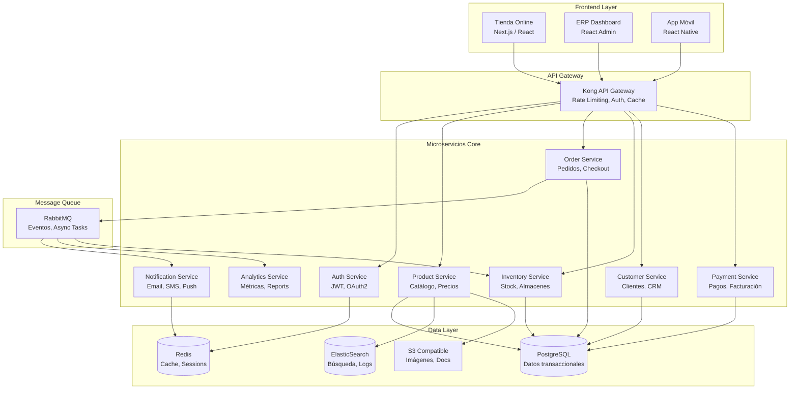

# 🚀 Propuesta de Arquitectura: Separación Tienda Online y ERP

## 📋 Resumen Ejecutivo

La separación lógica entre la tienda online (B2C) y el sistema ERP (B2B) es fundamental para escalar Brain2Gain. Esta propuesta detalla cómo reestructurar la arquitectura actual hacia un modelo de microservicios que permita:

- **Escalabilidad independiente** de cada sistema
- **Mejor experiencia de usuario** con interfaces especializadas
- **Mayor seguridad** al aislar datos sensibles del negocio
- **Desarrollo paralelo** por equipos especializados
- **Optimización de costos** al escalar solo lo necesario

## 🎯 Arquitectura Propuesta



## 🏗️ Plan de Migración por Fases

### Fase 1: Preparación y Separación de Dominios (2-3 semanas)
- [ ] Crear subdominios: `tienda.brain2gain.com` y `erp.brain2gain.com`
- [ ] Implementar API Gateway (Kong o similar)
- [ ] Separar bases de datos por contexto (bounded contexts)
- [ ] Implementar event sourcing para sincronización

### Fase 2: Microservicios Core (4-6 semanas)
- [ ] **Auth Service**: Centralizar autenticación con OAuth2/JWT
- [ ] **Product Service**: Gestión de catálogo y precios
- [ ] **Order Service**: Procesamiento de pedidos
- [ ] **Inventory Service**: Control de stock en tiempo real

### Fase 3: Servicios de Soporte (3-4 semanas)
- [ ] **Payment Service**: Integración con pasarelas de pago
- [ ] **Notification Service**: Emails, SMS, notificaciones push
- [ ] **Analytics Service**: Métricas y reportes en tiempo real
- [ ] **Customer Service**: CRM y gestión de clientes

### Fase 4: Optimización y Escalado (2-3 semanas)
- [ ] Implementar caching estratégico con Redis
- [ ] Configurar auto-scaling en Kubernetes
- [ ] Optimizar queries con read replicas
- [ ] Implementar CDN para assets estáticos

## 💼 Separación Funcional Tienda vs ERP

### 🛍️ Tienda Online (B2C)
**Objetivo**: Experiencia de compra rápida y fluida

#### Características:
- **Catálogo optimizado** con búsqueda elástica
- **Checkout simplificado** (1-2 pasos máximo)
- **Recomendaciones personalizadas** con ML
- **Reviews y ratings** de productos
- **Wishlist y comparador**
- **Chat en vivo** para soporte
- **PWA** para experiencia móvil

#### Stack Tecnológico:
```yaml
Frontend:
  - Framework: Next.js 14 (App Router)
  - UI: Tailwind CSS + Shadcn/ui
  - State: Zustand + React Query
  - Analytics: Google Analytics 4 + Hotjar

Backend:
  - API: GraphQL (Apollo Server)
  - Cache: Redis con TTL corto
  - CDN: CloudFlare
  - Search: Algolia o ElasticSearch
```

### 📊 Sistema ERP (B2B)
**Objetivo**: Control total del negocio

#### Módulos:
1. **Gestión de Inventario**
   - Control multi-almacén
   - Alertas de stock bajo
   - Predicción de demanda
   - Gestión de proveedores

2. **Gestión de Pedidos**
   - Estados personalizables
   - Picking y packing
   - Integración con transportistas
   - Devoluciones y RMA

3. **CRM Integrado**
   - Historial de clientes
   - Segmentación automática
   - Campañas de email
   - Programa de fidelización

4. **Finanzas**
   - Facturación automática
   - Conciliación bancaria
   - Reportes fiscales
   - Control de gastos

5. **Analytics Avanzado**
   - Dashboards en tiempo real
   - Predicción de ventas
   - Análisis de rentabilidad
   - KPIs personalizables

#### Stack Tecnológico:
```yaml
Frontend:
  - Framework: React Admin o Refine
  - UI: Ant Design Pro
  - Charts: Apache ECharts
  - Reports: PDF/Excel generation

Backend:
  - API: REST (FastAPI)
  - Queue: Celery + RabbitMQ
  - Reports: Pandas + Matplotlib
  - ML: Scikit-learn para predicciones
```

## 🔐 Seguridad y Compliance

### Medidas de Seguridad:
1. **Aislamiento de redes** (VPC separadas)
2. **Encriptación end-to-end** para datos sensibles
3. **Auditoría completa** de todas las acciones
4. **Backup automático** cada 6 horas
5. **Compliance GDPR** para datos de clientes

### Autenticación y Autorización:
```yaml
Tienda:
  - Social login (Google, Facebook)
  - Magic links por email
  - 2FA opcional
  
ERP:
  - SSO corporativo
  - 2FA obligatorio
  - Roles granulares (RBAC)
  - Sesiones con timeout
```

## 📈 Beneficios de Negocio

### 1. **Mejora en Conversión** (Tienda)
- Carga ultrarrápida (<2s)
- Checkout optimizado (+30% conversión)
- Búsqueda inteligente (+25% AOV)
- Personalización (+40% retention)

### 2. **Eficiencia Operativa** (ERP)
- Automatización de procesos (-60% tiempo)
- Reducción de errores (-80%)
- Visibilidad en tiempo real
- Toma de decisiones data-driven

### 3. **Escalabilidad**
- Manejo de picos (Black Friday)
- Expansión internacional
- Multi-canal (marketplace, B2B)
- Crecimiento sin límites técnicos

## 💰 Análisis de Costos

### Infraestructura Actual (Monolito):
```
- Servidor único: $500/mes
- Base de datos: $200/mes
- CDN: $50/mes
Total: ~$750/mes
```

### Infraestructura Propuesta (Microservicios):
```
- Kubernetes cluster: $400/mes
- Bases de datos: $300/mes
- Redis: $100/mes
- CDN + Storage: $150/mes
- Monitoring: $50/mes
Total: ~$1,000/mes

ROI: Se recupera con +10 pedidos/mes
```

## 🚀 Quick Wins Inmediatos

1. **Separar frontend de tienda** (1 semana)
   - Crear subdominio tienda.brain2gain.com
   - Deploy con Vercel/Netlify
   - Mejora inmediata en velocidad

2. **Implementar Redis Cache** (3 días)
   - Cache de productos y sesiones
   - Reducción 70% carga DB
   - Respuesta <100ms

3. **CDN para imágenes** (1 día)
   - Cloudinary o ImageKit
   - Optimización automática
   - Lazy loading

4. **API Gateway básico** (1 semana)
   - Rate limiting
   - API keys para ERP
   - Métricas de uso

## 📊 KPIs para Medir Éxito

### Técnicos:
- Time to First Byte (TTFB) < 200ms
- Uptime > 99.9%
- Error rate < 0.1%
- API response time < 100ms

### Negocio:
- Conversión rate > 3%
- Cart abandonment < 60%
- Customer lifetime value +25%
- Operational efficiency +40%

## 🛠️ Herramientas Recomendadas

### Development:
- **Monorepo**: Nx o Turborepo
- **CI/CD**: GitHub Actions + ArgoCD
- **Testing**: Jest + Cypress + k6
- **Docs**: Docusaurus

### Monitoring:
- **APM**: Datadog o New Relic
- **Logs**: ELK Stack
- **Uptime**: Better Uptime
- **Errors**: Sentry

### Colaboración:
- **API Docs**: Swagger/OpenAPI
- **Project**: Linear o Jira
- **Design**: Figma
- **Communication**: Slack

## 🎯 Próximos Pasos

1. **Semana 1-2**: 
   - Validar propuesta con stakeholders
   - Definir equipo y recursos
   - Crear POC de separación

2. **Semana 3-4**:
   - Implementar API Gateway
   - Separar primer microservicio (Auth)
   - Configurar CI/CD

3. **Mes 2-3**:
   - Migración incremental
   - Testing exhaustivo
   - Capacitación del equipo

4. **Mes 4+**:
   - Optimización continua
   - Nuevas features
   - Expansión internacional

## 💡 Conclusión

La separación de la tienda online y el ERP no es solo una mejora técnica, es una **inversión estratégica** que permitirá a Brain2Gain:

- Competir con grandes del sector
- Escalar sin límites técnicos
- Ofrecer mejor experiencia a clientes
- Optimizar operaciones internas
- Prepararse para el futuro (AI, IoT, etc.)

El ROI esperado es de 6-12 meses con mejoras inmediatas en performance y experiencia de usuario.

---

*"La arquitectura correcta no es la más compleja, sino la que mejor se adapta al negocio y puede evolucionar con él."*