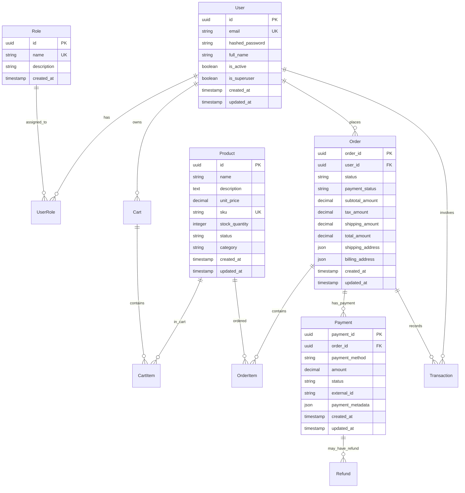

# 🗄️ Database Schema - Brain2Gain

## 📚 Overview

Brain2Gain uses PostgreSQL 17 as the primary database with SQLModel (SQLAlchemy + Pydantic) for ORM operations. The schema is designed for a complete e-commerce platform with event sourcing capabilities.

## 🏗️ Schema Architecture

### Core Principles
- **UUID Primary Keys**: All entities use UUID for better scalability
- **Audit Trail**: Created/updated timestamps on all entities
- **Soft Deletes**: Important entities support soft deletion
- **Event Sourcing**: Complete audit trail through event store
- **Referential Integrity**: Foreign key constraints with cascade rules

## 📊 Entity Relationship Diagram



## 📋 Detailed Table Specifications

### 👥 User Management

#### users
```sql
CREATE TABLE users (
    id UUID PRIMARY KEY DEFAULT gen_random_uuid(),
    email VARCHAR(255) UNIQUE NOT NULL,
    hashed_password VARCHAR(255) NOT NULL,
    full_name VARCHAR(255),
    is_active BOOLEAN DEFAULT true,
    is_superuser BOOLEAN DEFAULT false,
    created_at TIMESTAMP WITH TIME ZONE DEFAULT NOW(),
    updated_at TIMESTAMP WITH TIME ZONE DEFAULT NOW()
);

CREATE INDEX idx_users_email ON users(email);
CREATE INDEX idx_users_active ON users(is_active);
```

#### roles
```sql
CREATE TABLE roles (
    id UUID PRIMARY KEY DEFAULT gen_random_uuid(),
    name VARCHAR(50) UNIQUE NOT NULL,
    description TEXT,
    created_at TIMESTAMP WITH TIME ZONE DEFAULT NOW()
);

-- Default roles
INSERT INTO roles (name, description) VALUES
('USER', 'Basic customer access'),
('ADMIN', 'Full administrative access'),
('MANAGER', 'Business management access'),
('SELLER', 'Sales and inventory access'),
('ACCOUNTANT', 'Financial access');
```

#### user_roles
```sql
CREATE TABLE user_roles (
    user_id UUID REFERENCES users(id) ON DELETE CASCADE,
    role_id UUID REFERENCES roles(id) ON DELETE CASCADE,
    assigned_at TIMESTAMP WITH TIME ZONE DEFAULT NOW(),
    PRIMARY KEY (user_id, role_id)
);
```

### 📦 Product Management

#### products
```sql
CREATE TABLE products (
    id UUID PRIMARY KEY DEFAULT gen_random_uuid(),
    name VARCHAR(255) NOT NULL,
    description TEXT,
    unit_price DECIMAL(10,2) NOT NULL CHECK (unit_price >= 0),
    sku VARCHAR(50) UNIQUE NOT NULL,
    stock_quantity INTEGER DEFAULT 0 CHECK (stock_quantity >= 0),
    status VARCHAR(20) DEFAULT 'ACTIVE' CHECK (status IN ('ACTIVE', 'INACTIVE', 'DISCONTINUED')),
    category VARCHAR(100),
    created_at TIMESTAMP WITH TIME ZONE DEFAULT NOW(),
    updated_at TIMESTAMP WITH TIME ZONE DEFAULT NOW()
);

CREATE INDEX idx_products_sku ON products(sku);
CREATE INDEX idx_products_status ON products(status);
CREATE INDEX idx_products_category ON products(category);
CREATE INDEX idx_products_price ON products(unit_price);
```

### 🛒 Shopping Cart

#### carts
```sql
CREATE TABLE carts (
    id UUID PRIMARY KEY DEFAULT gen_random_uuid(),
    user_id UUID REFERENCES users(id) ON DELETE CASCADE,
    created_at TIMESTAMP WITH TIME ZONE DEFAULT NOW(),
    updated_at TIMESTAMP WITH TIME ZONE DEFAULT NOW()
);

CREATE UNIQUE INDEX idx_carts_user ON carts(user_id);
```

#### cart_items
```sql
CREATE TABLE cart_items (
    id UUID PRIMARY KEY DEFAULT gen_random_uuid(),
    cart_id UUID REFERENCES carts(id) ON DELETE CASCADE,
    product_id UUID REFERENCES products(id) ON DELETE CASCADE,
    quantity INTEGER NOT NULL CHECK (quantity > 0),
    unit_price DECIMAL(10,2) NOT NULL,
    created_at TIMESTAMP WITH TIME ZONE DEFAULT NOW(),
    updated_at TIMESTAMP WITH TIME ZONE DEFAULT NOW(),
    UNIQUE(cart_id, product_id)
);

CREATE INDEX idx_cart_items_cart ON cart_items(cart_id);
CREATE INDEX idx_cart_items_product ON cart_items(product_id);
```

### 📋 Order Management

#### orders
```sql
CREATE TABLE orders (
    order_id UUID PRIMARY KEY DEFAULT gen_random_uuid(),
    user_id UUID REFERENCES users(id) ON DELETE SET NULL,
    status VARCHAR(20) DEFAULT 'PENDING' CHECK (status IN (
        'PENDING', 'CONFIRMED', 'PROCESSING', 'SHIPPED', 
        'DELIVERED', 'CANCELLED', 'REFUNDED'
    )),
    payment_status VARCHAR(20) DEFAULT 'PENDING' CHECK (payment_status IN (
        'PENDING', 'PAID', 'FAILED', 'REFUNDED', 'PARTIALLY_REFUNDED'
    )),
    subtotal_amount DECIMAL(10,2) NOT NULL,
    tax_amount DECIMAL(10,2) DEFAULT 0,
    shipping_amount DECIMAL(10,2) DEFAULT 0,
    total_amount DECIMAL(10,2) NOT NULL,
    shipping_address JSONB,
    billing_address JSONB,
    notes TEXT,
    created_at TIMESTAMP WITH TIME ZONE DEFAULT NOW(),
    updated_at TIMESTAMP WITH TIME ZONE DEFAULT NOW()
);

CREATE INDEX idx_orders_user ON orders(user_id);
CREATE INDEX idx_orders_status ON orders(status);
CREATE INDEX idx_orders_payment_status ON orders(payment_status);
CREATE INDEX idx_orders_created ON orders(created_at);
CREATE INDEX idx_orders_total ON orders(total_amount);
```

#### order_items
```sql
CREATE TABLE order_items (
    id UUID PRIMARY KEY DEFAULT gen_random_uuid(),
    order_id UUID REFERENCES orders(order_id) ON DELETE CASCADE,
    product_id UUID REFERENCES products(id) ON DELETE SET NULL,
    product_name VARCHAR(255) NOT NULL,
    product_sku VARCHAR(50) NOT NULL,
    quantity INTEGER NOT NULL CHECK (quantity > 0),
    unit_price DECIMAL(10,2) NOT NULL,
    total_price DECIMAL(10,2) NOT NULL,
    created_at TIMESTAMP WITH TIME ZONE DEFAULT NOW()
);

CREATE INDEX idx_order_items_order ON order_items(order_id);
CREATE INDEX idx_order_items_product ON order_items(product_id);
```

### 💳 Payment Management

#### payments
```sql
CREATE TABLE payments (
    payment_id UUID PRIMARY KEY DEFAULT gen_random_uuid(),
    order_id UUID REFERENCES orders(order_id) ON DELETE CASCADE,
    payment_method VARCHAR(50) NOT NULL CHECK (payment_method IN (
        'stripe', 'paypal', 'bank_transfer', 'cash'
    )),
    amount DECIMAL(10,2) NOT NULL,
    status VARCHAR(20) DEFAULT 'PENDING' CHECK (status IN (
        'PENDING', 'PROCESSING', 'COMPLETED', 'FAILED', 'CANCELLED', 'REFUNDED'
    )),
    external_id VARCHAR(255),
    payment_metadata JSONB,
    created_at TIMESTAMP WITH TIME ZONE DEFAULT NOW(),
    updated_at TIMESTAMP WITH TIME ZONE DEFAULT NOW()
);

CREATE INDEX idx_payments_order ON payments(order_id);
CREATE INDEX idx_payments_status ON payments(status);
CREATE INDEX idx_payments_method ON payments(payment_method);
CREATE INDEX idx_payments_external ON payments(external_id);
```

#### refunds
```sql
CREATE TABLE refunds (
    refund_id UUID PRIMARY KEY DEFAULT gen_random_uuid(),
    payment_id UUID REFERENCES payments(payment_id) ON DELETE CASCADE,
    amount DECIMAL(10,2) NOT NULL,
    reason TEXT,
    status VARCHAR(20) DEFAULT 'PENDING' CHECK (status IN (
        'PENDING', 'PROCESSING', 'COMPLETED', 'FAILED'
    )),
    external_id VARCHAR(255),
    processed_at TIMESTAMP WITH TIME ZONE,
    created_at TIMESTAMP WITH TIME ZONE DEFAULT NOW()
);

CREATE INDEX idx_refunds_payment ON refunds(payment_id);
CREATE INDEX idx_refunds_status ON refunds(status);
```

### 📊 Transaction History

#### transactions
```sql
CREATE TABLE transactions (
    id UUID PRIMARY KEY DEFAULT gen_random_uuid(),
    user_id UUID REFERENCES users(id) ON DELETE SET NULL,
    order_id UUID REFERENCES orders(order_id) ON DELETE SET NULL,
    transaction_type VARCHAR(50) NOT NULL,
    amount DECIMAL(10,2) NOT NULL,
    description TEXT,
    metadata JSONB,
    created_at TIMESTAMP WITH TIME ZONE DEFAULT NOW()
);

CREATE INDEX idx_transactions_user ON transactions(user_id);
CREATE INDEX idx_transactions_order ON transactions(order_id);
CREATE INDEX idx_transactions_type ON transactions(transaction_type);
CREATE INDEX idx_transactions_created ON transactions(created_at);
```

### 🔄 Event Sourcing

#### event_store
```sql
CREATE TABLE event_store (
    id UUID PRIMARY KEY DEFAULT gen_random_uuid(),
    event_type VARCHAR(100) NOT NULL,
    aggregate_id UUID NOT NULL,
    aggregate_type VARCHAR(50) NOT NULL,
    data TEXT NOT NULL,
    metadata TEXT NOT NULL,
    occurred_at TIMESTAMP WITH TIME ZONE NOT NULL,
    version INTEGER DEFAULT 1,
    processed BOOLEAN DEFAULT false
);

CREATE INDEX idx_event_store_type ON event_store(event_type);
CREATE INDEX idx_event_store_aggregate ON event_store(aggregate_id);
CREATE INDEX idx_event_store_aggregate_type ON event_store(aggregate_type);
CREATE INDEX idx_event_store_occurred ON event_store(occurred_at);
CREATE INDEX idx_event_store_processed ON event_store(processed);
```

## 🔧 Database Constraints and Rules

### Business Rules Enforced at Database Level

#### Product Constraints
```sql
-- Ensure positive prices and stock
ALTER TABLE products ADD CONSTRAINT chk_product_price 
    CHECK (unit_price >= 0);
ALTER TABLE products ADD CONSTRAINT chk_product_stock 
    CHECK (stock_quantity >= 0);

-- SKU format validation (example)
ALTER TABLE products ADD CONSTRAINT chk_product_sku_format 
    CHECK (sku ~ '^[A-Z0-9-]+$');
```

#### Order Constraints
```sql
-- Ensure order totals are consistent
ALTER TABLE orders ADD CONSTRAINT chk_order_total 
    CHECK (total_amount = subtotal_amount + tax_amount + shipping_amount);

-- Ensure positive amounts
ALTER TABLE orders ADD CONSTRAINT chk_order_amounts_positive 
    CHECK (subtotal_amount >= 0 AND tax_amount >= 0 AND shipping_amount >= 0);
```

#### Payment Constraints
```sql
-- Ensure payment amount is positive
ALTER TABLE payments ADD CONSTRAINT chk_payment_amount_positive 
    CHECK (amount > 0);

-- Ensure refund doesn't exceed payment
-- (This would be enforced at application level due to complexity)
```

## 📈 Performance Optimizations

### Indexes for Common Queries

#### Product Search and Filtering
```sql
-- Full-text search on product names and descriptions
CREATE INDEX idx_products_search ON products 
    USING gin(to_tsvector('english', name || ' ' || COALESCE(description, '')));

-- Composite index for price range queries
CREATE INDEX idx_products_price_status ON products(unit_price, status) 
    WHERE status = 'ACTIVE';
```

#### Order Analytics
```sql
-- For order analytics and reporting
CREATE INDEX idx_orders_analytics ON orders(created_at, status, total_amount);

-- For user order history
CREATE INDEX idx_orders_user_date ON orders(user_id, created_at DESC);
```

#### Event Sourcing Performance
```sql
-- For event replay and aggregate reconstruction
CREATE INDEX idx_event_store_aggregate_time ON event_store(aggregate_id, occurred_at);

-- For unprocessed events
CREATE INDEX idx_event_store_unprocessed ON event_store(processed, occurred_at) 
    WHERE processed = false;
```

### Partitioning Strategy (Future)

#### Time-based Partitioning for Large Tables
```sql
-- Example for orders table (when volume increases)
CREATE TABLE orders_2024 PARTITION OF orders 
    FOR VALUES FROM ('2024-01-01') TO ('2025-01-01');

CREATE TABLE orders_2025 PARTITION OF orders 
    FOR VALUES FROM ('2025-01-01') TO ('2026-01-01');
```

## 🔄 Migration Strategy

### Alembic Migrations
The database schema is managed through Alembic migrations located in `backend/app/alembic/versions/`.

#### Key Migration Files
- `e2412789c190_initialize_models.py` - Initial schema creation
- `d98dd8ec85a3_edit_replace_id_integers_in_all_models.py` - UUID migration
- `2024121201_migrate_sales_order_to_order.py` - Order system migration
- `2024121202_migrate_data_sales_to_orders.py` - Data migration
- `2024121203_add_payment_refund_tables.py` - Payment system

#### Running Migrations
```bash
# Apply all pending migrations
cd backend
alembic upgrade head

# Create new migration
alembic revision --autogenerate -m "Description of changes"

# Rollback last migration
alembic downgrade -1
```

## 📊 Data Types and Conventions

### Standard Conventions
- **Primary Keys**: UUID with `gen_random_uuid()` default
- **Timestamps**: `TIMESTAMP WITH TIME ZONE` for all datetime fields
- **Money**: `DECIMAL(10,2)` for currency amounts
- **Status Fields**: VARCHAR with CHECK constraints
- **JSON Data**: JSONB for flexible schema data
- **Text Content**: TEXT for long content, VARCHAR for limited strings

### UUID Usage
All entities use UUID primary keys for:
- **Better Performance**: No hotspots in distributed systems
- **Security**: Non-guessable IDs
- **Scalability**: No auto-increment limitations
- **Merge Capability**: Easy to merge data from different sources

## 🧪 Test Data

### Development Seeds
```sql
-- Create test user
INSERT INTO users (email, hashed_password, full_name, is_superuser) VALUES
('admin@brain2gain.com', '$2b$12$...', 'Admin User', true),
('user@brain2gain.com', '$2b$12$...', 'Test User', false);

-- Create test products
INSERT INTO products (name, description, unit_price, sku, stock_quantity, category) VALUES
('Whey Protein Premium', 'High-quality whey protein', 49.99, 'WPP-001', 100, 'Proteins'),
('Creatine Monohydrate', 'Pure creatine supplement', 29.99, 'CM-001', 200, 'Supplements'),
('Pre-Workout Energy', 'Energy boost for workouts', 39.99, 'PWE-001', 150, 'Pre-Workout');
```

## 🔐 Security Considerations

### Data Protection
- **Password Hashing**: Bcrypt with salt rounds
- **PII Encryption**: Sensitive data encrypted at rest
- **Row-Level Security**: Future implementation for multi-tenancy
- **Audit Logging**: Complete event sourcing for compliance

### Access Control
- **Database Users**: Separate users for app, migration, read-only
- **Connection Pooling**: Managed through SQLAlchemy
- **SSL Connections**: Required for production
- **Backup Encryption**: Automated encrypted backups

---

This schema provides a solid foundation for the Brain2Gain e-commerce platform with room for future growth and optimization.